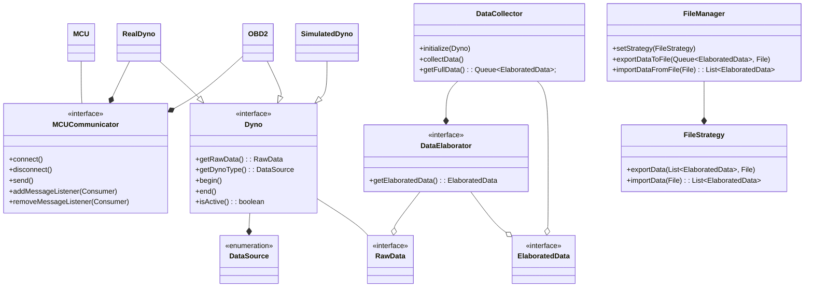

<center>
<h1>
Relazione del progetto 

“JavaDyno”
</h1>

<h2>

Alessandro Porcheddu  
Matteo Todeschi  
Christofer Napolitano  
Ivan Crimaldi
<br>

29 giugno 2025
</h2>

</center>
<br>

# Indice

## [1. Analisi](#capitolo-1---analisi)
- ### [1.1 Descrizione e requisiti](#11-descrizione-e-requisiti-1)
- ### [1.2 Analisi e modello del dominio](#12-analisi-e-modello-del-dominio-1)
## [2. Design](#capitolo-2---design)
- ### [2.1 Architettura](#21-architettura-1)
- ### [2.2 Design dettagliato](#22-design-dettagliato-1)
    - #### [2.2.1 Porcheddu Alessandro](#221-porcheddu-alessandro-1)
    - #### [2.2.2 Surname Name](#222-surname-name-1)
## [3. Sviluppo](#capitolo-3---sviluppo)
- ### [3.1 Testing automatizzato](#31-testing-automatizzato-1)
- ### [3.2 Note di sviluppo](#32-note-di-sviluppo-1)
    - #### [3.2.1 Porcheddu Alessandro](#321-porcheddu-alessandro-1)
    - #### [3.2.2 Surname Name](#322-surname-name-1)
## [4. Commenti finali](#capitolo-4---commenti-finali)
- ### [4.1 Autovalutazione e lavori futuri](#41-autovalutazione-e-lavori-futuri-1)
- ### [4.2 Difficoltà incontrate e commenti per i docenti](#42-difficoltà-incontrate-e-commenti-per-i-docenti-1)
## [Appendice A - Guida utente](#appendice-a---guida-utente-1)
## [Appendice B - Esercitazioni di laboratorio](#appendice-b---esercitazioni-di-laboratorio-1)
- ### [B.0.1 alessandro.porcheddu@studio.unibo.it](#b01-alessandroporcheddustudiouniboit-1)
- ### [B.0.2 matteo.todeschi@studio.unibo.it](#b02-matteotodeschistudiouniboit-1)
- ### [B.0.3 name.surname@studio.unibo.it](#b03-namesurnamestudiouniboit-1)
- ### [B.0.4 name.surname@studio.unibo.it](#b04-namesurnamestudiouniboit-1)

<br>

# Capitolo 1 - Analisi
## 1.1 Descrizione e Requisiti
Il software si presenta come un ambiente per la gestione e simulazione di un dinamometro per motori di varia natura. Il sistema permette a professionisti ed appassionati di visualizzare in maniera conveniente ed intuitiva le misure raccolte dalle proprie strumentazioni riguardo il motore in esame. L'interpretazione di tali dati fornisce all'utente finale informazioni molto importanti sullo stato attuale del motore e sulle possibili modifiche che si possono apportare per migliorarne le prestazioni e/o l'efficienza.  
L’utente ha la libertà di decidere se interagire con la parte di simulazione, se avviare una prova con strumentazione fisica oppure se acquisire i dati della prova dalla propria autovettura tramite porta OBD2 (presente su tutti i veicoli immatricolati nell'UE dal [1 gennaio 2004](https://en.wikipedia.org/wiki/On-board_diagnostics#History)).  
La simulazione comprende un minigioco per poter prendere dimestichezza con le operazioni che potranno poi essere effettuate nel mondo reale.
Il software comprende diverse opzioni per la personalizzazione della GUI e per il confronto di grafici salvati, in modo da poter lavorare in qualsiasi momento sui dati raccolti.

### Requisiti funzionali
- Operazioni sui grafici
    - Salvataggio ed esportazione grafici (in diversi formati)
    - Confronto di grafici con diverse opzioni di visualizzazione
    - Caricamento da file
- Assistenza real-time per prove su banco
    - Warning per raggiungimento soglie critiche o problemi di varia natura
    - Svolgimento della prova in modalità guidata per una ripetibilità più affidabile
- Comunicazione con hardware esterno
    - Compatibilità con un ampio range di interfacce USB
    - Capacità di comunicazione wireless
### Requisiti non funzionali
- Elaborazione dei grafici e dei dati in tempo reale con elevata precisione e fluidità
- Proporzioni grafiche invariate tra dispositivi con risoluzioni molto diverse

## 1.2 Analisi e modello del dominio
Il sistema si articola attorno a diverse entità chiave tra cui il dinamometro, reale o simulato che sia, un sistema di acquisizione dati, automatismi che garantiscono sicurezza e ottimizzazione e un’interfaccia che permetta all’utente di interagire e personalizzare l’acquisizione e la lettura dei dati.  
Un dinamometro è un dispositivo che, collegato ad un asse rotante connesso al relativo motore, permette di misurarne la potenza sprigionata a diversi regimi di rotazione. Esistono diverse tipologie di dinamometro ma la più diffusa in assoluto è il [freno magnetico a correnti parassite](https://www.elprocus.com/what-is-eddy-current-dynamometer-construction-its-working/).
I dati del dinamometro  vengono raccolti in 2 modi possibili: attraverso il collegamento con hardware esterno oppure simulandoli internamente all'applicazione.  

La comunicazione con hardware esterno risulta essere un dialogo con un microcontrollore che fornisce i dati acquisiti con sensori di varia natura. La simulazione si occupa di emulare il comportamento di un motore termico nelle sue componenti di base.
L’intero applicativo si basa su pacchetti di dati che vengono man mano raffinati in modo da arrivare al punto di essere interpretabili tramite grafici.
Inoltre viene utilizzata una di verifica dei dati per evitare che vi siano problemi e/o incongruenze nei e gestisce il comportamento dell’applicativo di conseguenza.


# Capitolo 2 - Design
## 2.1 Architettura
Per Java Dyno è stato scelto il pattern architetturale MVC (Model-View-Controller), che consente una chiara separazione tra logica, interfaccia e controllo, facilitando manutenzione e sviluppo futuro.  
Il **Controller** funge da coordinatore centrale per tutte le operazioni dell'applicazione. Esso gestisce il ciclo di vita delle simulazioni, coordina l'acquisizione dati dai dinamometri e orchestra l'aggiornamento dell'interfaccia utente. Inoltre accetta la registrazione di eventi dalla view (pressione pulsanti, navigazione tra schermate) e notifica gli aggiornamenti alle componenti grafiche ottenendo i dati attraverso un meccanismo di polling in thread separati.  
Il **Model** è rappresentato principalmente dall'interfaccia `Dyno` e dalle sue implementazioni, che costituiscono i punti d'ingresso per l'acquisizione e l'elaborazione dei dati. Il modello include anche il sistema di gestione dati attraverso `DataCollector` e `DataElaborator`, completamente indipendente dalle implementazioni di `Dyno`.  
Con questa architettura, è possibile sostituire completamente la view senza impattare controller o model: l'interfaccia `View` e le sue implementazioni sono completamente disaccoppiate dalla logica di core. Similmente, l'aggiunta di nuovi tipi di dinamometro richiede solo l'implementazione dell'interfaccia `Dyno` senza modificare il controller esistente.

```mermaid
UML TODO
```
## 2.2 Design dettagliato
### 2.2.1 Porcheddu Alessandro
#### Subject

```mermaid
UML TODO

```

**Problema:** TODO. 

**Soluzione:** TODO. 

---
#### Subject

```mermaid
UML TODO

```

**Problema:** TODO.

**Soluzione:** TODO.

```mermaid
UML TODO

```

TODO

### 2.2.1 Surname Name
#### Subject

```mermaid
UML TODO

```

**Problema:** TODO. 

**Soluzione:** TODO. 

---
#### Subject

```mermaid
UML TODO

```

**Problema:** TODO.

**Soluzione:** TODO.

```mermaid
UML TODO

```

TODO

# Capitolo 3 - Sviluppo
## 3.1 Testing automatizzato
Sono stati realizzati test automatici per le principali parti di Model in modo da facilitare lo sviluppo fin dalle prime fasi.
Per tale scopo è stato adottato _JUnit_ e componenti derivate che, inoltre, ci hanno permesso di controllare il risultato di tali test su più piattaforme in contemporanea grazie all'integrazione con _Gradle_ e GitHub workflows.

* OBD2DynoTest: test progettato per verificare il corretto funzionamento della logica di acquisizione dati tramite l'interfaccia OBD2. Vengono inoltre simulati diversi scenari di input per assicurare che i dati, come i giri del motore e la velocità del veicolo, vengano interpretati correttamente e che le operazioni di conversione siano accurate.
* SerialCommunicatorTest: classe implementata per un veloce riscontro all'inizio dello sviluppo per quanto riguarda l'interfacciamento con la libreria jSerialComm
* DataElaboratorImplTest: in questo caso il test prevede la crezione di dati pseudo realistici la verifica della correttezza dei calcoli sapendo il "trend" a priori. In particolare viene testata la componente di calcolo dell'OBD2 che risulta molto più articolata di quella del banco reale.
## 3.2 Note di sviluppo
### 3.2.1 Porcheddu Alessandro
#### Utilizzo di `LoopingIterator` dalla libreria **Apache Commons Collections**
Permalink: https://github.com/TodeschiMatteo/OOP24-java-dyno/blob/3ca4f9147495bf1de3cde73578cc8f701ab812c9/src/main/java/it/unibo/javadyno/model/dyno/obd2/impl/OBD2Dyno.java#L132

#### Utilizzo di `VirtualThread`
Scelti per limitare il context-switching e il consumo di risorse. Permalink: https://github.com/TodeschiMatteo/OOP24-java-dyno/blob/3ca4f9147495bf1de3cde73578cc8f701ab812c9/src/main/java/it/unibo/javadyno/model/dyno/impl/AbstractPhysicalDyno.java#L55-L57

#### Utilizzo della libreria **[jSerialComm](https://github.com/Fazecast/jSerialComm)**
Sfruttata per la parte di rilevamento e comunicazione multipiattaforma di interfacce seriali. Un esempio nel rilevamento della disconnessione: https://github.com/TodeschiMatteo/OOP24-java-dyno/blob/3ca4f9147495bf1de3cde73578cc8f701ab812c9/src/main/java/it/unibo/javadyno/model/data/communicator/impl/AbstractSerialCommunicator.java#L237

#### Utilizzo della libreria **[Java-WebSocket](https://github.com/TooTallNate/Java-WebSocket)**
Esempio di estensione e implementazione: https://github.com/TodeschiMatteo/OOP24-java-dyno/blob/3ca4f9147495bf1de3cde73578cc8f701ab812c9/src/main/java/it/unibo/javadyno/model/data/communicator/impl/AbstractWebSocketCommunicator.java#L120-L149

#### Utilizzo di `JSONObject` dalla libreria **[JSON-java](https://github.com/stleary/JSON-java)**
Permalink: https://github.com/TodeschiMatteo/OOP24-java-dyno/blob/3ca4f9147495bf1de3cde73578cc8f701ab812c9/src/main/java/it/unibo/javadyno/model/dyno/real/impl/RealDynoImpl.java#L19

### 3.2.2 Surname Name
#### Subject

TODO

#### Subject
TODO

# Capitolo 4 - Commenti finali
## 4.1 Autovalutazione e lavori futuri
### Surname Name
TODO

### Surname Name
TODO

### Surname Name
TODO

### Surname Name
TODO

## 4.2 Difficoltà incontrate e commenti per i docenti
TODO

# Appendice A - Guida utente
TODO


# Appendice B - Esercitazioni di laboratorio
## B.0.1 alessandro.porcheddu@studio.unibo.it
- Laboratorio 07: https://virtuale.unibo.it/mod/forum/discuss.php?d=177162#p246062
- Laboratorio 08: https://virtuale.unibo.it/mod/forum/discuss.php?d=178723#p247255
- Laboratorio 09: https://virtuale.unibo.it/mod/forum/discuss.php?d=179154#p248270
- Laboratorio 10: https://virtuale.unibo.it/mod/forum/discuss.php?d=180101#p248857
- Laboratorio 11: https://virtuale.unibo.it/mod/forum/discuss.php?d=181206#p250774
- Laboratorio 12: https://github.com/D3stan/oop-lab12

## B.0.2 matteo.todeschi@studio.unibo.it

- Laboratorio 06: https://virtuale.unibo.it/mod/forum/discuss.php?d=176282#p244944
- Laboratorio 07: https://virtuale.unibo.it/mod/forum/discuss.php?d=177162#p245974
- Laboratorio 08: https://virtuale.unibo.it/mod/forum/discuss.php?d=178723#p247203
- Laboratorio 09: https://virtuale.unibo.it/mod/forum/discuss.php?d=179154#p248253
- Laboratorio 10: https://virtuale.unibo.it/mod/forum/discuss.php?d=180101#p249647
- Laboratorio 11: https://virtuale.unibo.it/mod/forum/discuss.php?d=181206#p250772
- Laboratorio 12: https://github.com/TodeschiMatteo/oop-lab12.git

## B.0.3 name.surname@studio.unibo.it
- Laboratorio XX:

## B.0.4 name.surname@studio.unibo.it
- Laboratorio XX: