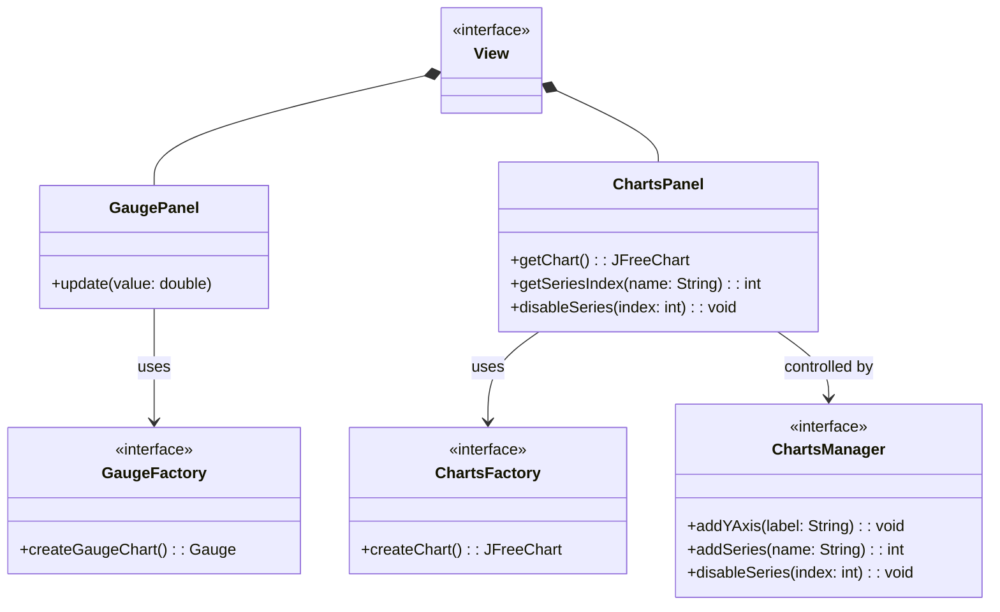

<p align="center">
<h1>
Relazione del progetto 
“JavaDyno”
</h1>

<h2>

Alessandro Porcheddu  
Matteo Todeschi  
Christofer Napolitano  
Ivan Crimaldi
<br>

29 giugno 2025
</h2>

</p>

<br>

# Indice

## [1. Analisi](#capitolo-1---analisi)
- ### [1.1 Descrizione e requisiti](#11-descrizione-e-requisiti-1)
- ### [1.2 Analisi e modello del dominio](#12-analisi-e-modello-del-dominio-1)
## [2. Design](#capitolo-2---design)
- ### [2.1 Architettura](#21-architettura-1)
- ### [2.2 Design dettagliato](#22-design-dettagliato-1)
    - #### [2.2.1 Porcheddu Alessandro](#221-porcheddu-alessandro-1)
    - #### [2.2.2 Todeschi Matteo](#222-todeschi-matteo-1)
    - #### [2.2.3 Surname Name](#222-surname-name-1)
## [3. Sviluppo](#capitolo-3---sviluppo)
- ### [3.1 Testing automatizzato](#31-testing-automatizzato-1)
- ### [3.2 Note di sviluppo](#32-note-di-sviluppo-1)
    - #### [3.2.1 Porcheddu Alessandro](#321-porcheddu-alessandro-1)
    - #### [3.2.2 Todeschi Matteo](#322-todeschi-matteo-1)
    - #### [3.2.3 Surname Name](#323-surname-name-1)
## [4. Commenti finali](#capitolo-4---commenti-finali)
- ### [4.1 Autovalutazione e lavori futuri](#41-autovalutazione-e-lavori-futuri-1)
    - #### [4.1.1 Porcheddu Alessandro](#41-autovalutazione-e-lavori-futuri-1)
    - #### [4.1.2 Todeschi Matteo](#41-autovalutazione-e-lavori-futuri-1)
- ### [4.2 Difficoltà incontrate e commenti per i docenti](#42-difficoltà-incontrate-e-commenti-per-i-docenti-1)
    - #### [4.2.1 Porcheddu Alessandro](#42-difficoltà-incontrate-e-commenti-per-i-docenti-1)
## [Appendice A - Guida utente](#appendice-a---guida-utente-1)
- ### [A.1 Schermata home](#a1-schermata-home)
- ### [A.2 Demo del software](#a2-demo-del-software)
- ### [A.3 Impostazioni utente](#a3-impostazioni-utente)
- ### [A.4 Confronto Grafici](#a4-confronto-grafici)
## [Appendice B - Esercitazioni di laboratorio](#appendice-b---esercitazioni-di-laboratorio-1)
- ### [B.0.1 alessandro.porcheddu@studio.unibo.it](#b01-alessandroporcheddustudiouniboit-1)
- ### [B.0.2 matteo.todeschi@studio.unibo.it](#b02-matteotodeschistudiouniboit-1)
- ### [B.0.3 name.surname@studio.unibo.it](#b03-namesurnamestudiouniboit-1)
- ### [B.0.4 name.surname@studio.unibo.it](#b04-namesurnamestudiouniboit-1)

<br>

# Capitolo 1 - Analisi
## 1.1 Descrizione e Requisiti
Il software si presenta come un ambiente per la gestione e simulazione di un dinamometro per motori di varia natura. Il sistema permette a professionisti ed appassionati di visualizzare in maniera conveniente ed intuitiva le misure raccolte dalle proprie strumentazioni riguardo il motore in esame. L'interpretazione di tali dati fornisce all'utente finale informazioni molto importanti sullo stato attuale del motore e sulle possibili modifiche che si possono apportare per migliorarne le prestazioni e/o l'efficienza.  
L’utente ha la libertà di decidere se interagire con la parte di simulazione, se avviare una prova con strumentazione fisica oppure se acquisire i dati della prova dalla propria autovettura tramite porta OBD2 (presente su tutti i veicoli immatricolati nell'UE dal [1 gennaio 2004](https://en.wikipedia.org/wiki/On-board_diagnostics#History)).  
La simulazione comprende un minigioco per poter prendere dimestichezza con le operazioni che potranno poi essere effettuate nel mondo reale.
Il software comprende diverse opzioni per la personalizzazione della GUI e per il confronto di grafici salvati, in modo da poter lavorare in qualsiasi momento sui dati raccolti.

### Requisiti funzionali
- Operazioni sui grafici
    - Salvataggio ed esportazione grafici (in diversi formati)
    - Confronto di grafici con diverse opzioni di visualizzazione
    - Caricamento da file
- Assistenza real-time per prove su banco
    - Warning per raggiungimento soglie critiche o problemi di varia natura
    - Svolgimento della prova in modalità guidata per una ripetibilità più affidabile
- Comunicazione con hardware esterno
    - Compatibilità con un ampio range di interfacce USB
    - Capacità di comunicazione wireless
### Requisiti non funzionali
- Elaborazione dei grafici e dei dati in tempo reale con elevata precisione e fluidità
- Proporzioni grafiche invariate tra dispositivi con risoluzioni molto diverse

## 1.2 Analisi e modello del dominio
Il sistema si articola attorno a diverse entità chiave tra cui il dinamometro, reale o simulato che sia, un sistema di acquisizione dati, automatismi che garantiscono sicurezza e ottimizzazione e un’interfaccia che permetta all’utente di interagire e personalizzare l’acquisizione e la lettura dei dati.  
Un dinamometro è un dispositivo che, collegato ad un asse rotante connesso al relativo motore, permette di misurarne la potenza sprigionata a diversi regimi di rotazione. Esistono diverse tipologie di dinamometro ma la più diffusa in assoluto è il [freno magnetico a correnti parassite](https://www.elprocus.com/what-is-eddy-current-dynamometer-construction-its-working/).
I dati del dinamometro  vengono raccolti in 2 modi possibili: attraverso il collegamento con hardware esterno oppure simulandoli internamente all'applicazione.  

La comunicazione con hardware esterno risulta essere un dialogo con un microcontrollore che fornisce i dati acquisiti con sensori di varia natura. La simulazione si occupa di emulare il comportamento di un motore termico nelle sue componenti di base.
L’intero applicativo si basa su pacchetti di dati che vengono man mano raffinati in modo da arrivare al punto di essere interpretabili tramite grafici.
Inoltre viene utilizzata una di verifica dei dati per evitare che vi siano problemi e/o incongruenze nei e gestisce il comportamento dell’applicativo di conseguenza.


# Capitolo 2 - Design
## 2.1 Architettura
Per Java Dyno è stato scelto il pattern architetturale MVC (Model-View-Controller), che consente una chiara separazione tra logica, interfaccia e controllo, facilitando manutenzione e sviluppo futuro.  
Il **Controller** funge da coordinatore centrale per tutte le operazioni dell'applicazione. Esso gestisce il ciclo di vita delle simulazioni, coordina l'acquisizione dati dai dinamometri e orchestra l'aggiornamento dell'interfaccia utente. Inoltre accetta la registrazione di eventi dalla view (pressione pulsanti, navigazione tra schermate) e notifica gli aggiornamenti alle componenti grafiche ottenendo i dati attraverso un meccanismo di polling in thread separati.  
Il **Model** è rappresentato principalmente dall'interfaccia `Dyno` e dalle sue implementazioni, che costituiscono i punti d'ingresso per l'acquisizione e l'elaborazione dei dati. Il modello include anche il sistema di gestione dati attraverso `DataCollector` e `DataElaborator`, completamente indipendente dalle implementazioni di `Dyno`.  
Con questa architettura, è possibile sostituire completamente la view senza impattare controller o model: l'interfaccia `View` e le sue implementazioni sono completamente disaccoppiate dalla logica di core. Similmente, l'aggiunta di nuovi tipi di dinamometro richiede solo l'implementazione dell'interfaccia `Dyno` senza modificare il controller esistente.


## 2.2 Design dettagliato
### 2.2.1 Porcheddu Alessandro
#### Comunicazione con hardware esterno


**Problema:** il software deve poter permettere ai diversi `Dyno` di comunicare con il relativo hardware esterno indipendentemente dal vettore di comunicazione (USB, Bluetooth, HTTP, WebSocket, ecc) e dal protocollo finale che si aspetta il microcontrollore. Quest'ultima, inoltre, deve avvenire in modo asincrono per non interferire con l'esecuzione del programma.  

**Soluzione:** la soluzione più idonea risulta essere l'utilizzo del pattern **Template Method** che permette una facile e veloce implementazione di un nuovo mezzo per comunicare con un possibile microcontrollore. In particolare l'interfaccia `MCUCommunicator` definisce il contratto da seguire per la comunicazione. Vengono poi definite 2 classi astratte relative a comunicazione seriale e websocket. Quest'ultime permettono di sviluppare classi aggiuntive specifiche per particolari microcontrollori implementando solo piccole porzioni di codice. Infatti `JsonWebSocketCommunicator` rappresenta un generico microcontrollore nel quale ci si aspetta di inviare e ricevere dati in formato JSON, mentre `ELM327Communicator` fa riferimento alla specifica implementazione di una comunicazione con l'omonimo chip OBD2. Si noti inoltre che l'interfaccia `MCUCommunicator` utilizza un generico per permetterealle implementazioni di gestire meglio i diversi tipi di messaggi nella comunicazione (come il `Pair` nel caso di `JsonWebSocketCommunicator`).

---

#### Scambio asincrono di dati


**Problema:** rendere la comunicazione con l'hardware esterno asincrona per rendersi indipendenti dai tempi di risposta di quest'ultimo e per garantire un'esperienza utente fluida.

**Soluzione:** per rispettare questi requisiti si ricorre al pattern **Observer**, dove l'applicazione richiede i dati in modo sincrono ma riceve una risposta asincrona. Ritroviamo nell'interfaccia `MCUCommunicator` i metodi `addMessageListener(Consumer<T>)` e il relativo `removeMessageListener(Consumer<T>)` che permettono ai clienti di registrare più di un _listener_ (e quindi di _Observers_). La classe astratta `AbstractPhysicalDyno`, attraverso il metodo astratto `handleMessage(T)`, fornisce ai clienti (ed a estensioni future) un contratto per ricevere ed elaborare i dati richiesti in ingresso. Infine, si pretende dai clienti che vengano inviati messaggi esclusivamente testuali e con un certo intervallo, per evitare fenomeno di _flooding_.

---

#### Creazione dei dati grezzi


**Problema:** ogni `Dyno` genera diversi dati in base a quali sensori sono stati installati, per esempio uno potrebbe monitorare in dettaglio le condizioni atmosferiche mentre l'altro ometterle completamente. Alcuni dati potrebbero anche venir trasmessi in maniera errata o essere persi durante la comunicazione. In generale sono presenti molti dati diversi.

**Soluzione:** viene fatto ampio utilizzo degli `Optional` per immagazzinare i dati in un _record_ `RawData` attraverso il pattern **Builder**. Quest'ultimo permette di creare `RawData` in maniera facilmente interpretabile e specificando solo i dati davvero utili. Infatti i restanti risulteranno essere un `Optional` vuoto, evitando di doverli impostare a un valore nullo o zero. In questo modo i clienti possono facilmente maneggiare i dati evitando eccezioni e controlli su eventuali valori _null_.

### 2.2.2 Todeschi Matteo
#### Gestione di simulazione concorrente


**Problema:** 
Far si che ogni implementazione di `SimulatedDyno` possa essere eseguita in modo concorrente, permettendo in primis di generare dati e aggiornarsi molto più velocemente rispetto alla frequenza di aggiornamento dell'appplicazione e dando inoltre all'utente la possibilità di interagire con l'applicazione senza blocchi o rallentamenti.

**Soluzione:**
Per risolvere il problema si è scelto di creare un interfaccia intemedia tra `Dyno` e `SimulatedDyno` che implementa l'interfaccia `Runnable`.  
In questo modo ogni implementazione di `SimulatedDyno` deve essere eseguita in un thread separato, permettendo di generare i dati in modo asincrono.  
La classe `SimulatedDynoImpl` implementa questa logica, gestendo la generazione dei dati e l'aggiornamento dello stato in modo concorrente.  
Degno di nota è anche il fatto che a fare le chiamate al nuovo Thread generato è il `Controller` tramite un suo Thread virtuale, in modo da non bloccare l'interfaccia utente e permettere all'utente di interagire con l'applicazione mentre la simulazione è in corso.  
Questa scelta permette inoltre di disaccoppiare il tempo di aggiornamento dello schermo da quello della generazione dei dati, permettendo di avere un'interfaccia utente sempre reattiva ma generando comunque tutti i dati necessari per l'elaborazione e il salvataggio.

#### Gestione degli errori con Monitor dedicato 


**Problema:**
Gestire gli errori in modo centralizzato e fornire un feedback all'utente senza bloccare l'applicazione.  
In particolare, è necessario gestire errori di comunicazione con l'hardware esterno, errori di elaborazione dei dati e altri errori generici.

**Soluzione:**
Per risolvere il problema si è scelto di implementare un monitor dedicato (`AlertMonitor`) implementato come utility statica.  
Ad essa viene abbinato un `Controller` che si occupa di instradare correttamente gli errori ad un componente della view che si occupa di visualizzarli (`AlertDisplayer`).  
I messaggi di errore hanno diverse priorità e vengono gestiti attraverso un enumerativo `AlertType` che permette di distinguere tra errori, avvisi e informazioni. In questo modo, l'utente può essere informato in modo chiaro e preciso senza bloccare l'applicazione.


#### Riutilizzo dei componenti della view


**Problema:**
Le view vanno pensate in modo da essere facilmente costruibili e soprattutto il più scarne possibile.
Esse infatti avranno diverse parti in comune e sarebbe sbagliato doverle riscrivere ogni volta che si vuole creare una nuova schermata.  
Inoltre, la view deve essere facilmente estendibile.
Sivorrebbe inoltre far si che una view possa in futoro essere estesa anche con altri componenti non ancora implementati.

**Soluzione:**
Per risolvere il problema si è scelto di implementare un pattern compositivo per la view, in modo da poter riutilizzare i componenti della view in diverse schermate.  
In particolare, sono stati creati diversi pannelli (`ButtonsPanel`, `ChartsPanel`, `GaugePanel`, `StatsPanel`) che possono essere combinati per creare diverse schermate.  
Essi, nella nostra implementazione con JavaFX, estendono i componenti `VBox` e `HBox` (che a loro volta estendono `Pane`) in modo da poter essere facilmente inseriti in varie view.

#### Visualizzazione di grafici multipli


**Problema:**
Permettere la personalizzazione degli elementi presenti in `GaugePanel` e `ChartsPanel` in modo da permettere un futuro una facile estensione e personalizzazione della view.
Si vuole inoltre cercare di limitare le operazioni che l'utente può fare sui grafici, in modo da evitare errori e rendere l'interfaccia più intuitiva.

**Soluzione:**
Utilizzare il pattern **Factory** per creare i grafici e i gauge, creando dunque un interfaccia funzionale per ognuno di questi componenti.
`GaugeFactory` e `ChartsFactory` sono quindi le interfacce che definiscono i metodi per creare i gauge e i grafici e possiedono anche una loro implementazione standard che verrà poi utilizzata per creare i componenti di default nella nostra applicazione ma nulla vieta in futuro di implementare nuove classi che estendono queste interfacce e che permettono di creare grafici e gauge personalizzati.  
Per quanto riguarda la gestione dei grafici, è stato creato rispettando il pattern **Façade** un `ChartsManager` che permette di limitare e standardizzare le operazioni che l'utente può fare sui grafici, come ad esempio aggiungere ulteriori asse Y, creare nuove serie, disabilitare serie esistenti.

### 2.2.3 Surname Name
#### Subject
```mermaid
UML TODO
```

# Capitolo 3 - Sviluppo
## 3.1 Testing automatizzato
Sono stati realizzati test automatici per le principali parti di Model in modo da facilitare lo sviluppo fin dalle prime fasi.
Per tale scopo è stato adottato _JUnit_ e componenti derivate che, inoltre, ci hanno permesso di controllare il risultato di tali test su più piattaforme in contemporanea grazie all'integrazione con _Gradle_ e _GitHub workflows_.

* `OBD2DynoTest`: test progettato per verificare il corretto funzionamento della logica di acquisizione dati tramite l'interfaccia OBD2. Vengono inoltre simulati diversi scenari di input per assicurare che i dati, come i giri del motore e la velocità del veicolo, vengano interpretati correttamente e che le operazioni di conversione siano accurate.
* `SerialCommunicatorTest`: classe implementata per un veloce riscontro all'inizio dello sviluppo per quanto riguarda l'interfacciamento con la libreria _jSerialComm_
* `DataElaboratorImplTest`: in questo caso il test prevede la crezione di dati pseudo realistici per la verifica della correttezza dei calcoli sapendo il "trend" a priori. In particolare viene testata la componente di calcolo dell'OBD2 che risulta molto più articolata di quella del banco reale.
* `SimulatedDynoImplTest `: questa classe di test verifica il corretto funzionamento della simulazione del dinamometro, assicurandosi che le chiamate logiche su questo oggeto funzionino correttamente.
Considerando l'utilizzo di un Thread separato per l'esecuzione della gerenazione di dati al suo interno, testare il corretto avvio, fermo e verifica dello stato risultava di fondamentale importanza.
* `build-and-deploy`: questo test prevede l'esecuzione in remoto su 3 _GitHub runners_ con sistemi operativi diversi (Ubuntu, Windows e MacOs) dei test di JUnit per assicurarsi la compatibilità multipiattaforma. Se nessun test fallisce viene anche rilasciato nel repo github un _fat jar_ dell'applicazione nella sezione _Releases_. Si noti che tutto ciò avviene solo in caso di rilevamento di _git tag_ per gestire il controllo delle versioni dell'applicazione e per rispettare i consumi previsti dal piano gratuito di _GitHub_.

Per quanto i componenti grafici, non si è optato per librerie di testing automatizzato, ma è stata piuttosto scelta la strada di creare una GUI minimale che veniva impostata come mainView dell'applicazione.  
Su di essa venivano poi aggiunti i singoli componenti grafici da testare (anche in combinazione), in modo da poter verificare il corretto funzionamento di questi ultimi.  
In `SimulatedDynoImplTest`è ancora possibile trovare lo scheletro di questa GUI di test senza componenti e metodi logici implementati.

## 3.2 Note di sviluppo
### 3.2.1 Porcheddu Alessandro
#### Utilizzo di `LoopingIterator` dalla libreria **Apache Commons Collections**
Permalink: https://github.com/TodeschiMatteo/OOP24-java-dyno/blob/3ca4f9147495bf1de3cde73578cc8f701ab812c9/src/main/java/it/unibo/javadyno/model/dyno/obd2/impl/OBD2Dyno.java#L132

#### Utilizzo di `VirtualThread`
Scelti per limitare il context-switching e il consumo di risorse. Permalink: https://github.com/TodeschiMatteo/OOP24-java-dyno/blob/3ca4f9147495bf1de3cde73578cc8f701ab812c9/src/main/java/it/unibo/javadyno/model/dyno/impl/AbstractPhysicalDyno.java#L55-L57

#### Utilizzo della libreria **[jSerialComm](https://github.com/Fazecast/jSerialComm)**
Sfruttata per la parte di rilevamento e comunicazione multipiattaforma di interfacce seriali. Un esempio nel rilevamento della disconnessione: https://github.com/TodeschiMatteo/OOP24-java-dyno/blob/3ca4f9147495bf1de3cde73578cc8f701ab812c9/src/main/java/it/unibo/javadyno/model/data/communicator/impl/AbstractSerialCommunicator.java#L237

#### Utilizzo della libreria **[Java-WebSocket](https://github.com/TooTallNate/Java-WebSocket)**
Esempio di estensione e implementazione: https://github.com/TodeschiMatteo/OOP24-java-dyno/blob/3ca4f9147495bf1de3cde73578cc8f701ab812c9/src/main/java/it/unibo/javadyno/model/data/communicator/impl/AbstractWebSocketCommunicator.java#L120-L149

#### Utilizzo di `JSONObject` dalla libreria **[JSON-java](https://github.com/stleary/JSON-java)**
Permalink: https://github.com/TodeschiMatteo/OOP24-java-dyno/blob/3ca4f9147495bf1de3cde73578cc8f701ab812c9/src/main/java/it/unibo/javadyno/model/dyno/real/impl/RealDynoImpl.java#L19

### 3.2.2 Todeschi Matteo

#### Utilizzo di `Optional`
Usati per rendere la descrizione degli Alert non obbligatoria  
Permalink: https://github.com/TodeschiMatteo/OOP24-java-dyno/blob/7805a79e84493b5acd015c3e7004dadca600180e/src/main/java/it/unibo/javadyno/controller/impl/AlertMonitor.java#L35

#### Utilizzo di `Stream`
Permalink: https://github.com/TodeschiMatteo/OOP24-java-dyno/blob/7805a79e84493b5acd015c3e7004dadca600180e/src/main/java/it/unibo/javadyno/model/graph/impl/ChartsManagerImpl.java#L47

#### Utilizzo di `Thread` mediante implementazione di `Runnable`
Permalink: https://github.com/TodeschiMatteo/OOP24-java-dyno/blob/7805a79e84493b5acd015c3e7004dadca600180e/src/main/java/it/unibo/javadyno/model/dyno/simulated/impl/SimulatedDynoImpl.java#L18

#### Utilizzo di `JavaFX` per la GUI
Permalink: https://github.com/TodeschiMatteo/OOP24-java-dyno/blob/7805a79e84493b5acd015c3e7004dadca600180e/src/main/java/it/unibo/javadyno/view/impl/EvaluatingView.java

#### Utilizzo della libreria **[JFreeChart](https://github.com/jfree/jfreechart)** per la visualizzazione dei grafici
L'utilizzo della libreria `JFreeChart` è accompagnato da un modulo dedicato alla compatibilità con JavaFX per inglobarlo in un container compatibile
Permalink: https://github.com/TodeschiMatteo/OOP24-java-dyno/blob/7805a79e84493b5acd015c3e7004dadca600180e/src/main/java/it/unibo/javadyno/model/graph/impl/ChartsManagerImpl.java

#### Utilizzo della libreria **[Medusa](https://github.com/HanSolo/medusa)** per la visualizzazione dei gauges
Permalink: https://github.com/TodeschiMatteo/OOP24-java-dyno/blob/7805a79e84493b5acd015c3e7004dadca600180e/src/main/java/it/unibo/javadyno/model/graph/impl/DefaultGaugeFactory.java#L18

### 3.2.3 Surname Name
#### Subject

TODO

#### Subject
TODO

# Capitolo 4 - Commenti finali
## 4.1 Autovalutazione e lavori futuri
### 4.1.1 Porcheddu Alessandro
Nonostante le difficoltà iniziali mi ritengo molto soddisfatto del progetto, in quanto sono contento di aver lavorato su un _proof-of-concept_ orientato verso l'utilizzo nel mondo reale. Sono altrettanto contento di essere riuscivo a scrivere codice e migliorarlo iterativamente ogni volta che pensavo di riuscire ad astrarre meglio alcuni concetti, anche se riconosco di aver tralasciato alcune parti secondarie per questioni di tempo. In particolare, non mi sarei dovuto far spavantare dall'idea di mettermi troppo presto a scrivere codice e non mi sarei dovuto fossilizzare troppo sull'analisi progettuale. Ritengo quest'ultima molto importante ma riconosco anche che il coordinamento di gruppo sull'analisi di un dominio non molto documentato è risultata molto lenta e macchinosa. Per quanto riguarda il mio ruolo nel progetto sono molto soddisfatto di essermi messo spesso in prima fila per aiutare i colleghi e, poichè il dominio del progetto era stato proposto da me, mi ritenevo anche in parte responsabile qualora sorgesse un dubbio. Inoltre sono anche particolarmente fiero di aver iniziato ad usare diversi strumenti accessori come _GitHub workflows_, estensioni per _VSCode_ (in particolare averne creata una ad-hoc per i report di _Gradle_) e macchine virtuali in locale per testare l'applicativo su diversi sistemi operativi. Aggiungo infine che sono molto propenso a continuare lo sviluppo di questo software per provare a fornire un'alternativa gratuita ed _open source_ a quelli attualmente in utilizzo nel panorama automobilistico, soprattuto amatoriale.

### 4.1.2 Todeschi Matteo
Lavorare a questo progetto è stato molto interessante per diversi motivi. In primis ho apprezzato molto lavorare su un qualcosa che potrebbe essere utilizzato nel mondo reale, in secondo luogo è stato probabilmente il primo grande progetto a cui ho avuto modo di partecipare.
Questo mi ha permesso di imparare molto su come si sviluppa un progetto e soprattutto di mettere in pratica le conoscenze acquisite.
Mi sono reso conto che se le prime volte che cominciavo a lavorarci sopra mi sentivo un po' perso, con il passare del tempo ho iniziato a capire come muovermi e quindi realizzare piccole variazioni o nuove funzionalità non mi sembrava più così difficile.
Devo inoltre riconoscere l'importanza del tempo dedicato alla progettazione e all'analisi, che mi ha permesso di avere una visione chiara di quello che dovevo fare fin dal primo momento.
Un altro aspetto che mi ha reso molto fiero è il fatto di utiizzare tecnologie e librerie che non avevo mai utilizzato prima in ottica di costruire applicazioni più complesse, rendendomi quindi cosapevole di come anche in ambito professionale venga utilizzato spesso questo approccio per la produzione di software.
Un ultimo appunto che devo fare è che l'utilizzo di strumenti per migliorare la qualità del codice, come _Checkstyle_, _SpotBugs_ e _PMD_, mi ha permesso di scrivere in modo più pulito e mantenibile, facilitando quindi non soltanto la lettura del mio codice ad altri, ma anche la mia stessa comprensione del codice scritto in precedenza.
Concludo dicendo che, come ad altri membri del gruppo, mi piacerebbe continuare a lavorare su questo progetto, in modo da poterlo rendere un prodotto finito e utilizzabile da chiunque.

### 4.1.3 Surname Name
TODO

### 4.1.4 Surname Name
TODO

## 4.2 Difficoltà incontrate e commenti per i docenti
### 4.2.1 Porcheddu Alessandro
Le difficoltà iniziali accennate nel paragrafo precedente fanno riferimento al non aver mai svolto un lavoro di gruppo prima d'ora, il che ha portato a una mia sottovalutazione della necessità di organizzarsi fin da subito in maniera efficace. Ho personalmente riscontrato anche difficoltà soprattutto nella parte iniziale di analisi, per la quale mi sembrava di avere pochi strumenti a mia disposizione. In particolare sarebbe stato utile aver avuto maggiore esposizione a sviluppare concetti _UML_ con una struttura guidata. Non nascondo, infatti, che la maggior difficoltà è stata mettersi a scrivere codice con ancora qualche dubbio sull'analisi e il design di alto livello. A questo proposito suggerirei ai docenti di fornine qualche tipo di strumento (anche magari una semplice _check list_) che permetta agli studenti di aver dei parametri oggettivi su cui basarsi per capire quando poter passare all'implementazione con un grado di confidenza mediamente alto.

### 4.2.2 Todeschi Matteo
La difficoltà principale cho ho riscontrato è stata principalmente quella di dover lavorare in gruppo, cosa che non avevo mai fatto prima su scala così grande.
Questo mi ha portato a dover imparare a gestire le dinamiche di gruppo, e soprattutto mi ha fatto capire l'importanza di avere una buona comunicazione e collaborazione tra i membri del gruppo, cosa che purtroppo non sempre è stata presente.
Una conseguente difficoltà è stata quella di trovarsi a iniziare a scrivere il codice così tardi rispetto alla deadline prefissata per la consegna del progetto, cosa che ha portato a dover lavorare in modo molto intenso per cercare di recuperare il tempo perso pur comunque sforando il limite massimo.
Credo infatti che sia stato impiegato troppo tempo nella fase di analisi e progettazione, che sebbene sia stata molto utile per avere una visione chiara del progetto, avrebbe potuto essere fatta in modo più rapido.
Inoltre il dover partecipare alle numerose lezioni del secondo semestre e ininziare la sezione estiva ha fatto slittare di molto la data che ci eravamo prefissati per l'inizio dell'implementazione.
Come consiglio per i docenti, oltre che concordare con il collega Alessandro su delle eventuali _check list_ da seguire, chiederei di rivalutare la scelta di non far coincidere la deadline con il periodo delle lezioni: capisco i motivi che hanno portato a questa scelta, ma credo che sarebbe più motivante per gli studenti poter lavorare al progetto nel periodo che preferiscono.

# Appendice A - Guida utente
## A.1 Schermata Home

In questa schermata l'utente può rapidamente decidere di premere i pulsanti che, in ordine dall'alto verso il basso, permettono di:
- **Dyno**: accedere alle prove con strumentazione fisica (OBD2 o banco prova)
- **Simulation**: accedere alla sala simulazioni
- **Charts**: accedere all'interfaccia per confrontare i grafici salvati
- **Settings**: accedere alle impostazioni utente che servono per gestire sia simulazione che prove fisiche  


## A.2 Demo del software
Per avviare una demo dell'applicativo basta cliccare il pulsante per entrare nella **simulazione** e successivamente premere **Start Simulation**.
Verrà simulata una prova a banco di un motore endotermico generico che terminerà in automatico una volta raggiunto il numero di giri impostato nei [Settings](#a3-impostazioni-utente).
Una volta conclusa la prova si potrà:
- farla ripartire da zero
- salvare i dati generati dall simulazione in un file
- importare dei dati per confrontarli _on-the-fly_
- tornare alla [Schermata Home](#a1-schermata-home)


## A.3 Impostazioni utente
In questa sezione si possono personalizzare i valori di _default_ per quanto riguarda simulazione e prova reale.
Si può anche scegliere il tipo di dinamometro da utilizzare per la prova (quindi reale oppure attraverso OBD2) attraverso una selezione a tendina.
Si noti che il pulsante **Save** salva i dati in un file nella _home directory_ dell'utente che verrà poi utilizzato da quel momento in avanti.

## A.4 Confronto grafici
L'interfaccia di questa schermata è molto semplice e permette di importare dei grafici attraverso il relativo pulsante.
Una volta importato almeno un grafico si potrà scegliere di nascondere o rivelare le curve importate con il pulsante nella parte inferiore e il relativo menù a comparsa.


# Appendice B - Esercitazioni di laboratorio
## B.0.1 alessandro.porcheddu@studio.unibo.it
- Laboratorio 07: https://virtuale.unibo.it/mod/forum/discuss.php?d=177162#p246062
- Laboratorio 08: https://virtuale.unibo.it/mod/forum/discuss.php?d=178723#p247255
- Laboratorio 09: https://virtuale.unibo.it/mod/forum/discuss.php?d=179154#p248270
- Laboratorio 10: https://virtuale.unibo.it/mod/forum/discuss.php?d=180101#p248857
- Laboratorio 11: https://virtuale.unibo.it/mod/forum/discuss.php?d=181206#p250774
- Laboratorio 12: https://github.com/D3stan/oop-lab12

## B.0.2 matteo.todeschi@studio.unibo.it

- Laboratorio 06: https://virtuale.unibo.it/mod/forum/discuss.php?d=176282#p244944
- Laboratorio 07: https://virtuale.unibo.it/mod/forum/discuss.php?d=177162#p245974
- Laboratorio 08: https://virtuale.unibo.it/mod/forum/discuss.php?d=178723#p247203
- Laboratorio 09: https://virtuale.unibo.it/mod/forum/discuss.php?d=179154#p248253
- Laboratorio 10: https://virtuale.unibo.it/mod/forum/discuss.php?d=180101#p249647
- Laboratorio 11: https://virtuale.unibo.it/mod/forum/discuss.php?d=181206#p250772
- Laboratorio 12: https://github.com/TodeschiMatteo/oop-lab12.git

## B.0.3 name.surname@studio.unibo.it
- Laboratorio XX:

## B.0.4 name.surname@studio.unibo.it
- Laboratorio XX: