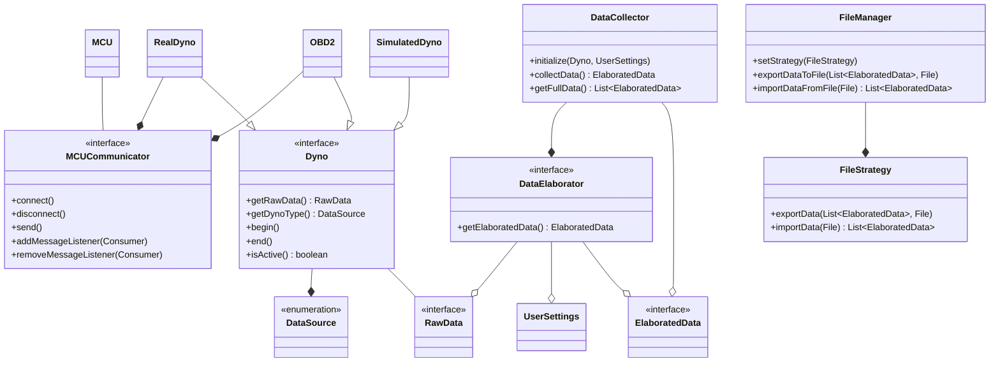

<p align="center">
<h1>
Relazione del progetto 
“JavaDyno”
</h1>

<h2>

Alessandro Porcheddu  
Matteo Todeschi  
Christofer Napolitano  
Ivan Crimaldi
<br>

29 giugno 2025
</h2>

</p>

<br>

# Indice

## [1. Analisi](#capitolo-1---analisi)
- ### [1.1 Descrizione e requisiti](#11-descrizione-e-requisiti-1)
- ### [1.2 Analisi e modello del dominio](#12-analisi-e-modello-del-dominio-1)
## [2. Design](#capitolo-2---design)
- ### [2.1 Architettura](#21-architettura-1)
- ### [2.2 Design dettagliato](#22-design-dettagliato-1)
    - #### [2.2.1 Porcheddu Alessandro](#221-porcheddu-alessandro-1)
    - #### [2.2.2 Surname Name](#222-surname-name-1)
## [3. Sviluppo](#capitolo-3---sviluppo)
- ### [3.1 Testing automatizzato](#31-testing-automatizzato-1)
- ### [3.2 Note di sviluppo](#32-note-di-sviluppo-1)
    - #### [3.2.1 Porcheddu Alessandro](#321-porcheddu-alessandro-1)
    - #### [3.2.2 Surname Name](#322-surname-name-1)
## [4. Commenti finali](#capitolo-4---commenti-finali)
- ### [4.1 Autovalutazione e lavori futuri](#41-autovalutazione-e-lavori-futuri-1)
- ### [4.2 Difficoltà incontrate e commenti per i docenti](#42-difficoltà-incontrate-e-commenti-per-i-docenti-1)
## [Appendice A - Guida utente](#appendice-a---guida-utente-1)
## [Appendice B - Esercitazioni di laboratorio](#appendice-b---esercitazioni-di-laboratorio-1)
- ### [B.0.1 alessandro.porcheddu@studio.unibo.it](#b01-alessandroporcheddustudiouniboit-1)
- ### [B.0.2 matteo.todeschi@studio.unibo.it](#b02-matteotodeschistudiouniboit-1)
- ### [B.0.3 name.surname@studio.unibo.it](#b03-namesurnamestudiouniboit-1)
- ### [B.0.4 name.surname@studio.unibo.it](#b04-namesurnamestudiouniboit-1)

<br>

# Capitolo 1 - Analisi
## 1.1 Descrizione e Requisiti
Il software si presenta come un ambiente per la gestione e simulazione di un dinamometro per motori di varia natura. Il sistema permette a professionisti ed appassionati di visualizzare in maniera conveniente ed intuitiva le misure raccolte dalle proprie strumentazioni riguardo il motore in esame. L'interpretazione di tali dati fornisce all'utente finale informazioni molto importanti sullo stato attuale del motore e sulle possibili modifiche che si possono apportare per migliorarne le prestazioni e/o l'efficienza.  
L’utente ha la libertà di decidere se interagire con la parte di simulazione, se avviare una prova con strumentazione fisica oppure se acquisire i dati della prova dalla propria autovettura tramite porta OBD2 (presente su tutti i veicoli immatricolati nell'UE dal [1 gennaio 2004](https://en.wikipedia.org/wiki/On-board_diagnostics#History)).  
La simulazione comprende un minigioco per poter prendere dimestichezza con le operazioni che potranno poi essere effettuate nel mondo reale.
Il software comprende diverse opzioni per la personalizzazione della GUI e per il confronto di grafici salvati, in modo da poter lavorare in qualsiasi momento sui dati raccolti.

### Requisiti funzionali
- Operazioni sui grafici
    - Salvataggio ed esportazione grafici (in diversi formati)
    - Confronto di grafici con diverse opzioni di visualizzazione
    - Caricamento da file
- Assistenza real-time per prove su banco
    - Warning per raggiungimento soglie critiche o problemi di varia natura
    - Svolgimento della prova in modalità guidata per una ripetibilità più affidabile
- Comunicazione con hardware esterno
    - Compatibilità con un ampio range di interfacce USB
    - Capacità di comunicazione wireless
### Requisiti non funzionali
- Elaborazione dei grafici e dei dati in tempo reale con elevata precisione e fluidità
- Proporzioni grafiche invariate tra dispositivi con risoluzioni molto diverse

## 1.2 Analisi e modello del dominio
Il sistema si articola attorno a diverse entità chiave tra cui il dinamometro, reale o simulato che sia, un sistema di acquisizione dati, automatismi che garantiscono sicurezza e ottimizzazione e un’interfaccia che permetta all’utente di interagire e personalizzare l’acquisizione e la lettura dei dati.  
Un dinamometro è un dispositivo che, collegato ad un asse rotante connesso al relativo motore, permette di misurarne la potenza sprigionata a diversi regimi di rotazione. Esistono diverse tipologie di dinamometro ma la più diffusa in assoluto è il [freno magnetico a correnti parassite](https://www.elprocus.com/what-is-eddy-current-dynamometer-construction-its-working/).
I dati del dinamometro  vengono raccolti in 2 modi possibili: attraverso il collegamento con hardware esterno oppure simulandoli internamente all'applicazione.  

La comunicazione con hardware esterno risulta essere un dialogo con un microcontrollore che fornisce i dati acquisiti con sensori di varia natura. La simulazione si occupa di emulare il comportamento di un motore termico nelle sue componenti di base.
L’intero applicativo si basa su pacchetti di dati che vengono man mano raffinati in modo da arrivare al punto di essere interpretabili tramite grafici.
Inoltre viene utilizzata una di verifica dei dati per evitare che vi siano problemi e/o incongruenze nei e gestisce il comportamento dell’applicativo di conseguenza.



# Capitolo 2 - Design
## 2.1 Architettura
Per Java Dyno è stato scelto il pattern architetturale MVC (Model-View-Controller), che consente una chiara separazione tra logica, interfaccia e controllo, facilitando manutenzione e sviluppo futuro.  
Il **Controller** funge da coordinatore centrale per tutte le operazioni dell'applicazione. Esso gestisce il ciclo di vita delle simulazioni, coordina l'acquisizione dati dai dinamometri e orchestra l'aggiornamento dell'interfaccia utente. Inoltre accetta la registrazione di eventi dalla view (pressione pulsanti, navigazione tra schermate) e notifica gli aggiornamenti alle componenti grafiche ottenendo i dati attraverso un meccanismo di polling in thread separati.  
Il **Model** è rappresentato principalmente dall'interfaccia `Dyno` e dalle sue implementazioni, che costituiscono i punti d'ingresso per l'acquisizione e l'elaborazione dei dati. Il modello include anche il sistema di gestione dati attraverso `DataCollector` e `DataElaborator`, completamente indipendente dalle implementazioni di `Dyno`.  
Con questa architettura, è possibile sostituire completamente la view senza impattare controller o model: l'interfaccia `View` e le sue implementazioni sono completamente disaccoppiate dalla logica di core. Similmente, l'aggiunta di nuovi tipi di dinamometro richiede solo l'implementazione dell'interfaccia `Dyno` senza modificare il controller esistente.


## 2.2 Design dettagliato
### 2.2.1 Porcheddu Alessandro
#### Comunicazione con hardware esterno


**Problema:** il software deve poter permettere ai diversi `Dyno` di comunicare con il relativo hardware esterno indipendentemente dal vettore di comunicazione (USB, Bluetooth, HTTP, WebSocket, ecc) e dal protocollo finale che si aspetta il microcontrollore. Quest'ultima, inoltre, deve avvenire in modo asincrono per non interferire con l'esecuzione del programma.  

**Soluzione:** la soluzione più idonea risulta essere l'utilizzo del pattern **Template Method** che permette una facile e veloce implementazione di un nuovo mezzo per comunicare con un possibile microcontrollore. In particolare l'interfaccia `MCUCommunicator` definisce il contratto da seguire per la comunicazione. Vengono poi definite 2 classi astratte relative a comunicazione seriale e websocket. Quest'ultime permettono di sviluppare classi aggiuntive specifiche per particolari microcontrollori implementando solo piccole porzioni di codice. Infatti `JsonWebSocketCommunicator` rappresenta un generico microcontrollore nel quale ci si aspetta di inviare e ricevere dati in formato JSON, mentre `ELM327Communicator` fa riferimento alla specifica implementazione di una comunicazione con l'omonimo chip OBD2. Si noti inoltre che l'interfaccia `MCUCommunicator` utilizza un generico per permetterealle implementazioni di gestire meglio i diversi tipi di messaggi nella comunicazione (come il `Pair` nel caso di `JsonWebSocketCommunicator`).

---

#### Scambio asincrono di dati


**Problema:** rendere la comunicazione con l'hardware esterno asincrona per rendersi indipendenti dai tempi di risposta di quest'ultimo e per garantire un'esperienza utente fluida.

**Soluzione:** per rispettare questi requisiti si ricorre al pattern **Observer**, dove l'applicazione richiede i dati in modo sincrono ma riceve una risposta asincrona. Ritroviamo nell'interfaccia `MCUCommunicator` i metodi `addMessageListener(Consumer<T>)` e il relativo `removeMessageListener(Consumer<T>)` che permettono ai clienti di registrare più di un _listener_ (e quindi di _Observers_). La classe astratta `AbstractPhysicalDyno`, attraverso il metodo astratto `handleMessage(T)`, fornisce ai clienti (ed a estensioni future) un contratto per ricevere ed elaborare i dati richiesti in ingresso. Infine, si pretende dai clienti che vengano inviati messaggi esclusivamente testuali e con un certo intervallo, per evitare fenomeno di _flooding_.

---

#### Creazione dei dati grezzi


**Problema:** ogni `Dyno` genera diversi dati in base a quali sensori sono stati installati, per esempio uno potrebbe monitorare in dettaglio le condizioni atmosferiche mentre l'altro ometterle completamente. Alcuni dati potrebbero anche venir trasmessi in maniera errata o essere persi durante la comunicazione. In generale sono presenti molti dati diversi.

**Soluzione:** viene fatto ampio utilizzo degli `Optional` per immagazzinare i dati in un _record_ `RawData` attraverso il pattern **Builder**. Quest'ultimo permette di creare `RawData` in maniera facilmente interpretabile e specificando solo i dati davvero utili. Infatti i restanti risulteranno essere un `Optional` vuoto, evitando di doverli impostare a un valore nullo o zero. In questo modo i clienti possono facilmente maneggiare i dati evitando eccezioni e controlli su eventuali valori _null_.

### 2.2.2 Todeschi Matteo
#### Gestione di simulazione concorrente


**Problema:** 
Far si che ogni implementazione di `SimulatedDyno` possa essere eseguita in modo concorrente, permettendo in primis di generare dati e aggiornarsi molto più velocemente rispetto alla frequenza di aggiornamento dell'appplicazione e dando inoltre all'utente la possibilità di interagire con l'applicazione senza blocchi o rallentamenti.

**Soluzione:**
Per risolvere il problema si è scelto di creare un interfaccia intemedia tra `Dyno` e `SimulatedDyno` che implementa l'interfaccia `Runnable`. In questo modo ogni implementazione di `SimulatedDyno` deve essere eseguita in un thread separato, permettendo di generare i dati in modo asincrono. La classe `SimulatedDynoImpl` implementa questa logica, gestendo la generazione dei dati e l'aggiornamento dello stato in modo concorrente.

#### Gestione degli errori con Monitor dedicato 
```mermaid
UML TODO
```

**Problema:** TODO.

**Soluzione:** TODO. 

**Soluzione:** TODO. 
#### Riutilizzo dei componenti della view
```mermaid
UML TODO
```

**Problema:** TODO.

**Soluzione:** TODO. 
#### Visualizzazione di grafici multipli
```mermaid
UML TODO
```

**Problema:** TODO.

**Soluzione:** TODO. 

### 2.2.3 Surname Name
#### Subject
```mermaid
UML TODO
```
### 2.2.3 Napolitano Cristofer
#### Vehicle Builder


**Problema:** la creazione di un oggetto `Vehicle` richiede la configurazione di numerosi parametri e dipendenze concrete (motore, trasmissione, modelli di carico, condizioni ambientali), e un costruttore monolitico impedirebbe l’estensibilità e violerebbe i principi SRP e DIP.

**Soluzione:** si applica il Builder pattern: `VehicleBuilder` espone metodi `with…` per ogni parametro di configurazione, costruendo passo dopo passo le dipendenze concrete (`EngineImpl`, `ManualTransmission`, `SimpleTorqueMap`, `TargetTemperatureModel`, `WeatherStationImpl`, `BenchLoad`, `RollingResistance`, `RigidDriveTrainSim`) e infine invocando `buildVehiclewithRigidModel()` per ottenere un’istanza di `VehicleImpl`. Questa soluzione isola la logica di composizione, rispetta il DIP e consente di aggiungere nuove opzioni senza modificare il costruttore centrale.

#### Drive Train


**Problema:** occorre modellare il gruppo moto in modo da eseguire il passo di simulazione, gestire i cambi di rapporto e calcolare la coppia netta sottraendo i vari carichi, il tutto garantendo flessibilità per diverse implementazioni di motore, trasmissione e carichi.

**Soluzione:** `RigidDriveTrainSim` implementa l’interfaccia `DriveTrain` e realizza una composizione 'uno a molti' con `Engine`, `Transmission` e `LoadModel`. Grazie al DIP, ogni componente interagisce tramite le proprie interfacce, applicando SRP delegando a `EngineImpl`, `ManualTransmission`, `BenchLoad` e `RollingResistance` le rispettive responsabilità, e consentendo l’aggiunta di nuovi modelli di carico senza modificare il simulatore di base.

#### Engine


**Problema:** il motore deve generare coppia in funzione di apertura del gas e regime, e al tempo stesso gestire l’evoluzione termica, ma una classe monolitica risulterebbe rigida e difficile da estendere.

**Soluzione:** si definiscono le interfacce `TorqueMap` e `TemperatureModel`; `EngineImpl` le compone e delega il calcolo della coppia a `SimpleTorqueMap` (Strategy pattern) e l’aggiornamento termico a `TargetTemperatureModel`. In tal modo si rispetta DIP, OCP e SRP: è immediato aggiungere nuove implementazioni di mappa coppia o modelli termici senza modificare `EngineImpl`.

#### Vehicle e WeatherStation


**Problema:** è necessario orchestrare l’interazione tra il veicolo, il drivetrain e la fonte dei dati ambientali, tuttociò per raccogliere i parametri operativi in un unico oggetto RawData per analisi e logging.

**Soluzione:** `VehicleImpl` realizza l’interfaccia `Vehicle`, componendo `DriveTrain` e `WeatherStation`; delega la logica di guida e cambio marcia a `DriveTrain`, interroga `WeatherStationImpl` per le condizioni ambientali e aggrega tutti i dati in `RawData`. Questa architettura a componenti riutilizzabili rispetta SRP e DIP e garantisce facilmente estensibilità e testabilità.


# Capitolo 3 - Sviluppo
## 3.1 Testing automatizzato
Sono stati realizzati test automatici per le principali parti di Model in modo da facilitare lo sviluppo fin dalle prime fasi.
Per tale scopo è stato adottato _JUnit_ e componenti derivate che, inoltre, ci hanno permesso di controllare il risultato di tali test su più piattaforme in contemporanea grazie all'integrazione con _Gradle_ e GitHub workflows.

* OBD2DynoTest: test progettato per verificare il corretto funzionamento della logica di acquisizione dati tramite l'interfaccia OBD2. Vengono inoltre simulati diversi scenari di input per assicurare che i dati, come i giri del motore e la velocità del veicolo, vengano interpretati correttamente e che le operazioni di conversione siano accurate.
* SerialCommunicatorTest: classe implementata per un veloce riscontro all'inizio dello sviluppo per quanto riguarda l'interfacciamento con la libreria jSerialComm
* DataElaboratorImplTest: in questo caso il test prevede la crezione di dati pseudo realistici la verifica della correttezza dei calcoli sapendo il "trend" a priori. In particolare viene testata la componente di calcolo dell'OBD2 che risulta molto più articolata di quella del banco reale.
## 3.2 Note di sviluppo
### 3.2.1 Porcheddu Alessandro
#### Utilizzo di `LoopingIterator` dalla libreria **Apache Commons Collections**
Permalink: https://github.com/TodeschiMatteo/OOP24-java-dyno/blob/3ca4f9147495bf1de3cde73578cc8f701ab812c9/src/main/java/it/unibo/javadyno/model/dyno/obd2/impl/OBD2Dyno.java#L132

#### Utilizzo di `VirtualThread`
Scelti per limitare il context-switching e il consumo di risorse. Permalink: https://github.com/TodeschiMatteo/OOP24-java-dyno/blob/3ca4f9147495bf1de3cde73578cc8f701ab812c9/src/main/java/it/unibo/javadyno/model/dyno/impl/AbstractPhysicalDyno.java#L55-L57

#### Utilizzo della libreria **[jSerialComm](https://github.com/Fazecast/jSerialComm)**
Sfruttata per la parte di rilevamento e comunicazione multipiattaforma di interfacce seriali. Un esempio nel rilevamento della disconnessione: https://github.com/TodeschiMatteo/OOP24-java-dyno/blob/3ca4f9147495bf1de3cde73578cc8f701ab812c9/src/main/java/it/unibo/javadyno/model/data/communicator/impl/AbstractSerialCommunicator.java#L237

#### Utilizzo della libreria **[Java-WebSocket](https://github.com/TooTallNate/Java-WebSocket)**
Esempio di estensione e implementazione: https://github.com/TodeschiMatteo/OOP24-java-dyno/blob/3ca4f9147495bf1de3cde73578cc8f701ab812c9/src/main/java/it/unibo/javadyno/model/data/communicator/impl/AbstractWebSocketCommunicator.java#L120-L149

#### Utilizzo di `JSONObject` dalla libreria **[JSON-java](https://github.com/stleary/JSON-java)**
Permalink: https://github.com/TodeschiMatteo/OOP24-java-dyno/blob/3ca4f9147495bf1de3cde73578cc8f701ab812c9/src/main/java/it/unibo/javadyno/model/dyno/real/impl/RealDynoImpl.java#L19

### 3.2.2 Surname Name
#### Subject

TODO

#### Subject
TODO

### 3.2.4 Napolitano Cristofer
#### Uso di stream in `RigidDriveTrainSim.step()`
usato per sommare tutti i nuovi carichi dei LoadModel : https://github.com/TodeschiMatteo/OOP24-java-dyno/blob/b751bbc65c9c86bf2315d438e0d5f4e200725a7c/src/main/java/it/unibo/javadyno/model/dyno/simulated/impl/RigidDriveTrainSim.java#L37C1-L46C1

# Capitolo 4 - Commenti finali
## 4.1 Autovalutazione e lavori futuri
### Surname Name
TODO

### Surname Name
TODO

### Surname Name
TODO

### 4.1.4 Napolitano Cristofer
L'idea di lavorare su un progetto che avrebbe avuto dei riscontri nel mondo reale sicuramente è stata una delle fonti di maggior stimolo per me, soprattutto nella ricerca di una soluzione che mi potesse dare in futuro la possibilità di espandere il progetto, proprio per questo le nozioni sui pattern e i principi di programmazione appresi durante il corso hanno subito trovato un luogo nel quale esser applicati e compresi appieno nelle nuove possibilità di espansione che offrono. Per appunto, la cosa che mi ha lasciato più soddisfatto dal lavoro svolto sono l'utilizzo estensivo di pattern come Strategy che mi daranno in futuro la possibilità di ampliare la soluzione.
Dirigendomi verso le note di più amare dello sviluppo del progetto sicuramente c'è stata la fase di analisi e design architetturale, considerando la mia inesperienza, e quella del gruppo, avremmo potuto perder meno tempo ed esser molto più obiettivi nei nostri lavori iniziali, questo è stato il motivo principale per la consegna in ritardo. Se fossi stato meno vago nel mio design iniziale, e quindi se avessi avuto più esperienza, sarei sicuramente stato in grado finire con largo anticipo la mia parte di model e di dare una mano molto più concreta nelle implementazioni del controller e della view senza lasciare un onere troppo grande ai miei colleghi.
Nel breve futuro spero vivamente di trovare il tempo di aggiungere implementazioni ulteriori al mio modello di simulazione, così da ricreare il comportamento di un veicolo con maggior fedeltà.

## 4.2 Difficoltà incontrate e commenti per i docenti


# Appendice A - Guida utente
TODO


# Appendice B - Esercitazioni di laboratorio
## B.0.1 alessandro.porcheddu@studio.unibo.it
- Laboratorio 07: https://virtuale.unibo.it/mod/forum/discuss.php?d=177162#p246062
- Laboratorio 08: https://virtuale.unibo.it/mod/forum/discuss.php?d=178723#p247255
- Laboratorio 09: https://virtuale.unibo.it/mod/forum/discuss.php?d=179154#p248270
- Laboratorio 10: https://virtuale.unibo.it/mod/forum/discuss.php?d=180101#p248857
- Laboratorio 11: https://virtuale.unibo.it/mod/forum/discuss.php?d=181206#p250774
- Laboratorio 12: https://github.com/D3stan/oop-lab12

## B.0.2 matteo.todeschi@studio.unibo.it

- Laboratorio 06: https://virtuale.unibo.it/mod/forum/discuss.php?d=176282#p244944
- Laboratorio 07: https://virtuale.unibo.it/mod/forum/discuss.php?d=177162#p245974
- Laboratorio 08: https://virtuale.unibo.it/mod/forum/discuss.php?d=178723#p247203
- Laboratorio 09: https://virtuale.unibo.it/mod/forum/discuss.php?d=179154#p248253
- Laboratorio 10: https://virtuale.unibo.it/mod/forum/discuss.php?d=180101#p249647
- Laboratorio 11: https://virtuale.unibo.it/mod/forum/discuss.php?d=181206#p250772
- Laboratorio 12: https://github.com/TodeschiMatteo/oop-lab12.git

## B.0.3 name.surname@studio.unibo.it
- Laboratorio XX:

## B.0.4 name.surname@studio.unibo.it
- Laboratorio XX: